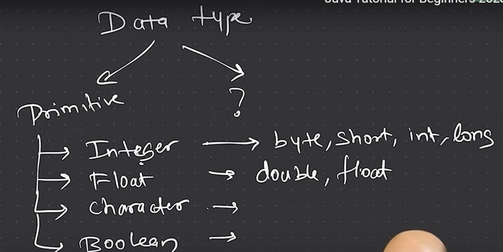

# Variables and Data Types

## 1. Data Types in Java

Java is a statically typed language, which means that all variables must first be declared before they can be used. This involves stating the variable's data type and name.

1. **Primitive Data Types**: These are the most basic data types available within the Java language. There are 8: `byte`, `short`, `int`, `long`, `float`, `double`, `boolean`, and `char`.
2. **Non-Primitive Data Types**: These are not defined by the programming language, but are created by the programmer. Examples include `String`, `Arrays`, `Classes`, `Interfaces`, etc.



### Floating Point Data Types

1. **float**: 32-bit single precision floating point.
2. **double**: 64-bit double precision floating point.
For example:

```java
float f = 10.5f;
double d = 10.5;
```

### Character Data Type

1. **char**: 16-bit Unicode character.
For example:

```java
char c = 'A';
char cAscii = 65; // ASCII value of 'A'
c = c+1; // c = 'B'

```

### Literal

To represent numbers in a nice way, Java has provided different types of literals. For example:

```java
int i = 10_000_000;
double d = 12e10; // 12 * 10^10

```

## 2. Type Casting vs. Type Conversion

- **Type Casting**: It is when you assign a value of one primitive data type to another type. For example:

```java
int i = 100;
byte b = (byte)i;
```

- **Type Conversion**: It is when you convert the value of one data type to another data type. For example:

```java
byte b = 100;
int i = b;
```

## 3. Postfix and Prefix Operators

- **Postfix Operators**: The expression is evaluated first using the original value of the variable and then the value is updated. For example:

```java
int i = 10;
System.out.println(i++); // Output: 10
System.out.println(i); // Output: 11
```

- **Prefix Operators**: The value is first updated and then the expression is evaluated. For example:

```java
int i = 10;
System.out.println(++i); // Output: 11
System.out.println(i); // Output: 11
```

## 4. Final Keyword

The `final` keyword is used in several different contexts to define an entity that can only be assigned once. Once a `final` variable has been assigned, it always contains the same value. For example:

```java
final int i = 10;
i = 20; // Compile time error
```

## 5. Summary

- Java is a statically, strongly typed language.
- Primitive data types are the most basic data types available within Java.
There are 8 primitive data types: `byte`, `short`, `int`, `long`, `float`, `double`, `boolean`, and `char`.
- Non-primitive data types include `String`, `Arrays`, `Classes`, `Interfaces`, etc.
- Java provides different types of literals to represent numbers in a nice way.
- Type casting is when you assign a value of one primitive data type to another type.
- Type conversion is when you convert the value of one data type to another data type.
- Postfix operators first evaluate the expression using the original value of the variable and then update the value.
- Prefix operators first update the value and then evaluate the expression.
- The `final` keyword is used to define an entity that can only be assigned once.
