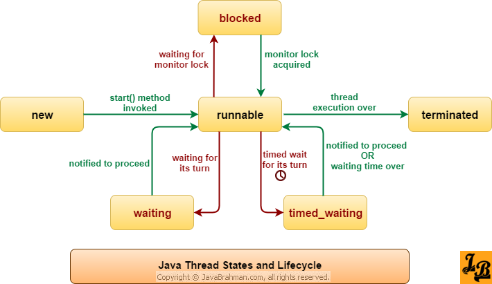

# Threads in Java

## Terminology

### Process

A process is an application that is running on a computer. It is an instance of a program that is being executed. A process is an independent entity to which system resources (e.g. CPU time and memory) are allocated.

- Has its own memory space, heap, and stack.
- Can have multiple threads.

### Thread

A thread is the smallest unit of execution within a process. A thread is a path of execution within a process. A process can have multiple threads.

- Threads within the same process share the same memory space.
- Threads share the heap memory and static variables.
- Each thread has its own stack memory.


### Concurrency

Concurrency is the ability of a system to run multiple threads in parallel to achieve faster execution.

### Multithreading

Multithreading is a programming technique that allows a single process to have multiple threads of execution.

### Atomicity

Atomicity is the property of a set of operations to be executed as a single unit of work. In other words, either all operations are executed or none

### Deadlock

Deadlock is a situation in which two or more threads are waiting for each other to release a resource, resulting in a standstill.

### Starvation

Starvation is a situation in which a thread is unable to gain regular access to shared resources and is unable to make progress.

### Interleaving

Interleaving is the process of dividing a single process into multiple threads that are executed concurrently. Time slicing is also known as time-sharing or time division.
It's a technique used in multitasking operating systems, to allow multiple threads or processes to share a single CPU for execution.
Available CPU time is sliced into small time intervals, which are divvied out to the threads.
Each thread gets that interval, to attempt to make some progress, on the tasks it has to do.
Whether it completes its task or not, in that time slice, doesn't matter to the thread management system. 
When the time is up, it has to yield to another thread, and wait until its turn again.
Unfortunately, when your threads are sharing heap memory, things can change during that wait.


## Thread States

A thread can be in one of the following states:

1. **New**: A thread that has been created but has not yet started.
2. **Runnable**: A thread that is ready to run.
3. **Running**: A thread that is currently running.
4. **Blocked**: A thread that is waiting for a monitor lock to enter a synchronized block/method.
5. **Waiting**: A thread that is waiting indefinitely for another thread to perform a particular action.
6. **Timed Waiting**: A thread that is waiting for another thread to perform a particular action for up to a specified waiting time.
7. **Terminated**: A thread that has exited.



## Creating Threads

There are two ways to create threads in Java:

1. **Extending the `Thread` class**: Create a subclass of the `Thread` class and override the `run()` method.

```java

public class CustomThread extends Thread {

    @Override
    public void run() {

        for (int i = 1; i <= 5; i++) {
            System.out.print(" 1 ");
            try {
                Thread.sleep(500);  // Adding a 1-second delay between each count
            } catch (InterruptedException e) {
                e.printStackTrace();
            }
        }
    }
}


public class Main {

    public static void main(String[] args) {

        var currentThread = Thread.currentThread();
        System.out.println(currentThread.getClass().getName());

        System.out.println(currentThread);
        printThreadState(currentThread);

        currentThread.setName("MainGuy");
        currentThread.setPriority(Thread.MAX_PRIORITY);
        printThreadState(currentThread);
    }

    public static void printThreadState(Thread thread) {

        System.out.println("----------------------");
        System.out.println("Thread ID: " + thread.getId());
        System.out.println("Thread Name: " + thread.getName());
        System.out.println("Thread Priority: " + thread.getPriority());
        System.out.println("Thread State: " + thread.getState());
        System.out.println("Thread Group: " + thread.getThreadGroup());
        System.out.println("Thread Is Alive: " + thread.isAlive());
        System.out.println("----------------------");
    }
}

```

**Output**:

```plaintext

// Output
java.lang.Thread
Thread[main,5,main]
----------------------
Thread ID: 1
Thread Name: main
Thread Priority: 5
Thread State: RUNNABLE
Thread Group: java.lang.ThreadGroup[name=main,maxpri=10]
Thread Is Alive: true
----------------------
----------------------
Thread ID: 1
Thread Name: MainGuy
Thread Priority: 10
Thread State: RUNNABLE
Thread Group: java.lang.ThreadGroup[name=main,maxpri=10]
Thread Is Alive: true
----------------------------

```

**Notes**:

1. The `Thread` class is a part of the `java.lang` package.
2. The `Thread` class provides several methods to manage threads, such as `start()`, `sleep()`, `yield()`, `join()`, `isAlive()`, `setName()`, `setPriority()`, etc.
3. The `start()` method is used to start the execution of a thread. It internally calls the `run()` method.
4. The `sleep()` method is used to pause the execution of the current thread for a specified period of time.
5. The `yield()` method is used to pause the execution of the current thread and allow other threads to execute.
6. The `join()` method is used to wait for a thread to die.
7. The `isAlive()` method is used to check if a thread is alive.
8. The `setName()` method is used to set the name of a thread.
9. The `setPriority()` method is used to set the priority of a thread, which can be in the range of 1 to 10. The default priority is 5. A higher priority thread has more chances of being executed than a lower priority thread.

2. **Implementing the `Runnable` interface**: Implement the `Runnable` interface and pass an instance of the class to the `Thread` constructor.

```java

public class CustomRunnable implements Runnable {

    @Override
    public void run() {

        for (int i = 1; i <= 5; i++) {
            System.out.print(" 1 ");
            try {
                Thread.sleep(500);  // Adding a 1-second delay between each count
            } catch (InterruptedException e) {
                e.printStackTrace();
            }
        }
    }
}

public class Main {

    public static void main(String[] args) {

        var customRunnable = new CustomRunnable();
        var thread = new Thread(customRunnable);
        thread.start();
    }
}

```

**Output**:

```plaintext

1  1  1  1  1

```

**Notes**:

1. The `Runnable` interface is a functional interface that has only one abstract method, `run()`.


## Thread Synchronization

#### Race Condition

Race conditions occur when two or more threads try to modify a shared resource at the same time. This can lead to data inconsistency and unexpected results.

**Example**:

```java

public class Counter {

    private int count = 0;

    public void increment() {
        count++;
    }

    public int getCount() {
        return count;
    }
}


public class Main {

    public static void main(String[] args) {

        var counter = new Counter();

        var thread1 = new Thread(() -> {
            for (int i = 1; i <= 1000; i++) {
                counter.increment();
            }
        });

        var thread2 = new Thread(() -> {
            for (int i = 1; i <= 1000; i++) {
                counter.increment();
            }
        });

        thread1.start();
        thread2.start();

        try {
            thread1.join();
            thread2.join();
        } catch (InterruptedException e) {
            e.printStackTrace();
        }

        System.out.println("Count: " + counter.getCount());
    }
}

```

**Output**:

```plaintext

Count: 1998

```

**Notes**:

1. In the above example, we have a `Counter` class with an `increment()` method that increments the `count` variable by 1.
2. We have two threads, `thread1` and `thread2`, that increment the `count` variable by 1, 1000 times each.
3. When we run the program, we expect the `count` variable to be 2000. However, due to race conditions, the value is less than 2000.

---

In a multithreaded environment, multiple threads can access shared resources concurrently. This can lead to data inconsistency and racw conditions. To prevent this, we can use synchronization.

### Synchronized Blocks

A synchronized block is a block of code that is synchronized on some object. Only one thread can execute a synchronized block of code on the same object at a time.

```java

public class Counter {

    private int count = 0;

    public void increment() {
        synchronized (this) {
            count++;
        }
    }

    public int getCount() {
        return count;
    }
}


## Example Program

```java
class OddThread extends Thread {

    @Override
    public void run() {

        for (int i = 1; i <= 10; i += 2) {
            System.out.println("OddThread: " + i);
            try {
                Thread.sleep(1000);
            } catch (InterruptedException e) {
                System.out.println("OddThread interrupted!");
                break;
            }
        }
    }
}

class EvenRunnable implements Runnable {

    @Override
    public void run() {

        for (int i = 2; i <= 10; i += 2) {
            System.out.println("EvenRunnable: " + i);
            try {
                Thread.sleep(1000);
            } catch (InterruptedException e) {
                System.out.println("EvenRunnable interrupted!");
                break;
            }
        }
    }
}

public class Main {

    public static void main(String[] args) {

        OddThread oddThread = new OddThread();

        Runnable runnable = () -> {
            for (int i = 2; i <= 10; i += 2) {
                System.out.println("EvenRunnable: " + i);
                try {
                    Thread.sleep(1000);
                } catch (InterruptedException e) {
                    System.out.println("EvenRunnable interrupted!");
                    break;
                }
            }
        };

        Thread evenThread = new Thread(runnable);
        oddThread.start();
        evenThread.start();

        try {
            Thread.sleep(2000);
        } catch (InterruptedException e) {
            e.printStackTrace();
        }

        oddThread.interrupt();
    }
}

```

## Time Slicing


Time slicing is the process of dividing the CPU time into smaller time slices and allocating these time slices to different threads.

```java

package dev.lpa;

import java.util.concurrent.TimeUnit;

public class Main {

    public static void main(String[] args) {

        StopWatch stopWatch = new StopWatch(TimeUnit.SECONDS);
        Thread green = new Thread(stopWatch::countDown, ThreadColor.ANSI_GREEN.name());
        Thread purple = new Thread(() -> stopWatch.countDown(7),
                ThreadColor.ANSI_PURPLE.name());
        Thread red = new Thread(stopWatch::countDown, ThreadColor.ANSI_RED.name());
        green.start();
        purple.start();
        red.start();
    }
}

class StopWatch {

    private TimeUnit timeUnit;
    private int i;

    public StopWatch(TimeUnit timeUnit) {
        this.timeUnit = timeUnit;
    }

    public void countDown() {
        countDown(5);
    }

    public void countDown(int unitCount) {

        String threadName = Thread.currentThread().getName();

        ThreadColor threadColor = ThreadColor.ANSI_RESET;
        try {
            threadColor = ThreadColor.valueOf(threadName);
        } catch (IllegalArgumentException ignore) {
            // User may pass a bad color name, Will just ignore this error.
        }
        String color = threadColor.color();
        for (i = unitCount; i > 0; i--) {
            try {
                timeUnit.sleep(1);
            } catch (InterruptedException e) {
                e.printStackTrace();
            }
            System.out.printf("%s%s Thread : i = %d%n", color, threadName, i);
        }
    }
}

enum ThreadColor {
    ANSI_RESET("\u001B[0m"),
    ANSI_BLACK("\u001B[30m"),
    ANSI_RED("\u001B[31m"),
    ANSI_GREEN("\u001B[32m"),
    ANSI_YELLOW("\u001B[33m"),
    ANSI_BLUE("\u001B[34m"),
    ANSI_PURPLE("\u001B[35m"),
    ANSI_CYAN("\u001B[36m"),
    ANSI_WHITE("\u001B[37m");

    private final String code;

    ThreadColor(String code) {
        this.code = code;
    }

    public String color() {
        return code;
    }
}


```

**Output**:

```plaintext

Thread : i = 7
Thread : i = 5
Thread : i = 5
Thread : i = 6
Thread : i = 4
Thread : i = 4

```

## Thread Pools

A thread pool is a collection of threads that can be used to execute tasks concurrently. It manages the creation, execution, and termination of threads.

