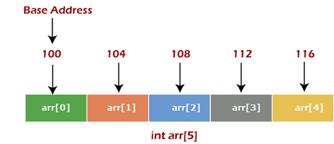

# Array, ArrayList and List in Java


- [Arrays](#1-arrays)
- [ArrayList](#2-arraylist)
- [LinkedList](#3-linkedlist)
- [Java In-built Lists](#4-java-in-built-lists)
- [Array vs. ArrayList vs. LinkedList](#5-array-vs-arraylist-vs-linkedlist)
- [Arrays Class](#6-arrays-class)
- [Collections Class](#7-collections-class)
- [Iterator](#8-iterator)
- [ListIterator](#9-listiterator)
- [Comparable and Comparator](#10-comparable-and-comparator)

## 1. Arrays

- Arrays are used to store multiple values in a single variable.
- Should be declared with a specific size (all elements should be of the same type).
- The size of an array is fixed and cannot be changed once it is created.
- The index of the first element in an array is 0.
- The index of the last element in an array is `length - 1`.
- They are contiguous blocks of memory. The elements are stored in consecutive memory locations. For example, if the first element is stored at memory location `1000`, the second element will be stored at `1004` (assuming each element takes 4 bytes). That's why arrays have a fixed size. If you want to add more elements, you need to create a new array with a larger size and copy the elements from the old array to the new array.

This is how an array looks in memory:


Syntax:

```java
// Declaration
int[] numbers = new int[5];

// Initialization
for (int i = 0; i < numbers.length; i++) {
    numbers[i] = (i + 1) * 10;
}

// Accessing elements
System.out.println(numbers[0]); // 10
System.out.println(numbers[1]); // 20
```

This line will throw an `ArrayIndexOutOfBoundsException` because the index is out of bounds:

```java
System.out.println(numbers[5]);
```

### Array Methods

- `length`: Returns the length of the array.
- `clone()`: Creates a shallow copy of the array.
- `equals()`: Compares two arrays for equality.
- `fill()`: Assigns the specified value to each element of the array.
- `sort()`: Sorts the array in ascending order.
- `binarySearch()`: Searches for the specified element in the array using a binary search algorithm.

```java
int[] numbers = {5, 3, 8, 2, 1};

// Length
System.out.println(numbers.length); // 5
System.out.println(Arrays.toString(numbers)); // [5, 3, 8, 2, 1]
System.out.println(Arrays.toString(numbers.clone())); // [5, 3, 8, 2, 1]
System.out.println(Arrays.equals(numbers, new int[]{5, 3, 8, 2, 1})); // true
System.out.println(Arrays.equals(numbers, new int[]{5, 3, 8, 2, 0})); // false
```

## 2. ArrayList

- An `ArrayList` is a resizable array that can grow or shrink in size dynamically.
- It is part of the `java.util` package.
- It is implemented using an array internally.

Syntax:

```java
// Declaration
ArrayList<Integer> numbers = new ArrayList<>();

// Initialization
for (int i = 0; i < 5; i++) {
    numbers.add((i + 1) * 10);
}

// Accessing elements
System.out.println(numbers.get(0)); // 10
System.out.println(numbers.get(1)); // 20

```

### ArrayList Methods

- `add()`: Adds an element to the end of the list. Internally, it increases the size of the array if necessary by creating a new array with a larger size and copying the elements from the old array to the new array.
- `add(index, element)`: Adds an element at the specified index.
- `get(index)`: Returns the element at the specified index.
- `remove(index)`: Removes the element at the specified index. Internally, it performs shifting to fill the gap created by removing the element.
- `remove(element)`: Removes the first occurrence of the specified element.
- `size()`: Returns the number of elements in the list.
- `clear()`: Removes all elements from the list.
- `contains(element)`: Returns `true` if the list contains the specified element.
- `indexOf(element)`: Returns the index of the first occurrence of the specified element.
- `lastIndexOf(element)`: Returns the index of the last occurrence of the specified element.
- `isEmpty()`: Returns `true` if the list is empty.

```java
ArrayList<Integer> numbers = new ArrayList<>(Arrays.asList(5, 3, 8, 2, 1));

// Size
System.out.println(numbers.size()); // 5

// Adding elements
numbers.add(50);
numbers.add(60);

// Removing elements
numbers.remove(0);
numbers.remove(Integer.valueOf(60)); // Removes the first occurrence of the specified element

// Contains
System.out.println(numbers.contains(50)); // true

// Index
System.out.println(numbers.indexOf(8)); // 2
System.out.println(numbers.lastIndexOf(8)); // 2
System.out.println(numbers.indexOf(100)); // -1

// Is Empty
System.out.println(numbers.isEmpty()); // false

// Clear
numbers.clear();
System.out.println(numbers.isEmpty()); // true
```

## 3. LinkedList

- A `LinkedList` is a collection of elements where each element has a reference to the next element in the list. Unlike an `ArrayList`, it does not store elements in contiguous memory locations.
- It is part of the `java.util` package.
- It is implemented using a doubly linked list internally.
- It is slower than an `ArrayList` for random access but faster for adding and removing elements. As it does not store elements in contiguous memory locations, which means more time is required to access an element at a specific index.
- It is more memory-intensive than an `ArrayList` because each element in a `LinkedList` has a reference to the next element. So, it requires more memory to store the same number of elements compared to an `ArrayList` (next and previous references).
- Traverse the list using the `next` and `previous` references.
- Insertion and deletion are faster because you only need to update the references of the adjacent elements. No need to shift elements like in an `ArrayList`.

## 4. Java In-built Lists

- Java provides several in-built list implementations in the `java.util` package.
- Some of the commonly used list implementations are:
  - `ArrayList`: Resizable array implementation.
  - `LinkedList`: Doubly linked list implementation.
  - `Vector`: Synchronized resizable array implementation.
  - `Stack`: LIFO (Last In First Out) implementation.
  - `CopyOnWriteArrayList`: Thread-safe resizable array implementation.
  - `AbstractList`: Abstract base class for list implementations.
  - `AbstractSequentialList`: Abstract base class for sequential access list implementations.
  - `AbstractSequentialList`: Abstract base class for random access list implementations.

## 5. Array vs. ArrayList vs. LinkedList

- **Array**:
  - Fixed size.
  - Faster for random access.
  - Slower for adding and removing elements.
  - Contiguous memory locations.
  - Memory-efficient.

- **ArrayList**:
  - Resizable.
  - Slower for random access.
  - Faster for adding and removing elements.
  - Contiguous memory locations.
  - Memory-efficient.

- **LinkedList**:
  - Resizable.
  - Slower for random access.
  - Faster for adding and removing elements.
  - Non-contiguous memory locations.
  - Memory-intensive.

## 6. Arrays Class

## 7. Collections Class

## 8. Iterator

## 9. ListIterator

## 10. Comparable and Comparator
