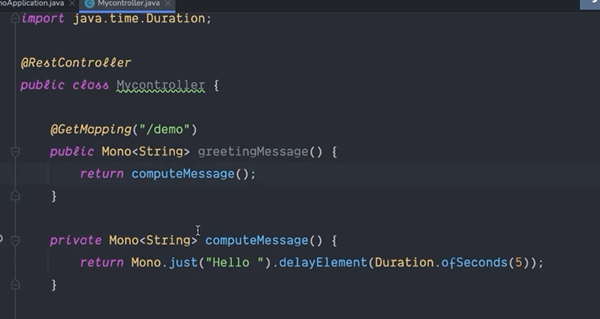

# Reactive Programming in Java

Reactive programming is a programming paradigm that treats computation as the propagation of data streams. It is based on the observer pattern and is used to handle asynchronous and event-based programming. In Java, reactive programming can be implemented using libraries such as RxJava, Reactor, and Akka.

We will explore **Reactor** in this section.

## Introduction to Reactor

Reactor is a reactive programming library for building non-blocking applications in Java. It provides two main types of reactive streams: `Flux` for handling multiple values and `Mono` for handling a single value.

### 1. Flux

```java
Flux<Integer> numbers = Flux.just(1, 2, 3, 4, 5);
numbers.map(i -> i * i).subscribe(System.out::println);
```

### 2. Mono

```java
Mono<Integer> number = Mono.just(1);
number.map(i -> i * i).subscribe(System.out::println);
```

Reactor provides a rich set of operators for transforming, filtering, and combining streams of data. It also supports backpressure, error handling, and concurrency.

### Observer Pattern

Reactor is based on the observer pattern, where a `Publisher` emits data streams that are observed by `Subscribers`. The `Publisher` can emit multiple values (`Flux`) or a single value (`Mono`), and the `Subscribers` can apply transformations and consume the data streams.

```java

Flux<Integer> numbers = Flux.just(2, 3, 4, 5, 6);
numbers.map(i -> i * i).subscribe(System.out::println);

```

Note: The `map` operator transforms each value emitted by the `Flux` by squaring it.
It returns a new `Flux` with the transformed values.

```java

Flux<Integer> numbers = Flux.just(2, 3, 4, 5, 6);
Flux<Integer> squaredNumbers = numbers.map(i -> i * i);
squaredNumbers.subscribe(System.out::println);

```

Note: The publisher calls the method inside the `subscribe` method for each value emitted by the `Flux`.

### 3. Operators

Reactor provides a wide range of operators for transforming, filtering, and combining streams of data. Some common operators include `map`, `filter`, `flatMap`, `zip`, `merge`, `concat`, and `reduce`.

Example of using the `filter` operator:

```java

Flux<Integer> numbers = Flux.just(1, 2, 3, 4, 5);
numbers.filter(i -> i % 2 == 0).subscribe(System.out::println);

```

Note: The `filter` operator filters out the odd numbers from the `Flux`.

Example of using the `flatMap` operator:

```java
Flux<Integer> numbers = Flux.just(1, 2, 3);

numbers.flatMap(i -> Flux.just(i, i * i)).subscribe(System.out::println);

```

Note: The `flatMap` operator transforms each value emitted by the `Flux` into a new `Flux` of two values (the original value and its square).

Example of using the `zip` operator:

```java

Flux<Integer> numbers1 = Flux.just(1, 2, 3);
Flux<Integer> numbers2 = Flux.just(4, 5, 6);

Flux.zip(numbers1, numbers2, (a, b) -> a + b).subscribe(System.out::println);

```

Note: The `zip` operator combines the corresponding values from two `Flux` streams and applies a function to them.

Example of using the `merge` operator:

```java

Flux<Integer> numbers1 = Flux.just(1, 2, 3);
Flux<Integer> numbers2 = Flux.just(4, 5, 6);

Flux.merge(numbers1, numbers2).subscribe(System.out::println);

```

Note: The `merge` operator merges the values emitted by two `Flux` streams into a single `Flux`.

Example of using the `concat` operator:

```java

Flux<Integer> numbers1 = Flux.just(1, 2, 3);
Flux<Integer> numbers2 = Flux.just(4, 5, 6);

Flux.concat(numbers1, numbers2).subscribe(System.out::println);

```

Note: The `concat` operator concatenates the values emitted by two `Flux` streams into a single `Flux`.

Example of using the `reduce` operator:

```java

Flux<Integer> numbers = Flux.just(1, 2, 3, 4, 5);
numbers.reduce(0, (a, b) -> a + b).subscribe(System.out::println);

```

Note: The `reduce` operator applies a binary operator to the values emitted by the `Flux` and returns a single value.

### 4. Backpressure

Reactor supports backpressure, which allows the `Subscriber` to control the rate at which it consumes data from the `Publisher`. This prevents the `Publisher` from overwhelming the `Subscriber` with data.

```java

Flux<Integer> numbers = Flux.range(1, 1000);

numbers.subscribe(new BaseSubscriber<Integer>() {
    @Override
    protected void hookOnSubscribe(Subscription subscription) {
        request(1);
    }

    @Override
    protected void hookOnNext(Integer value) {
        System.out.println(value);
        request(1);
    }
});

```

Note: The `BaseSubscriber` class provides hooks for handling the subscription and the emitted values. The `request` method is used to request a specific number of values from the `Publisher`.

