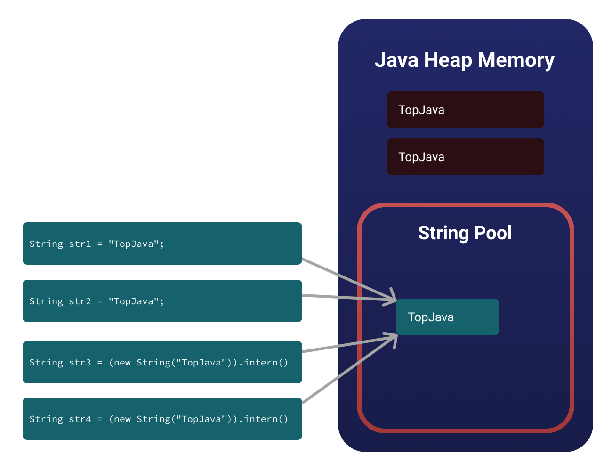
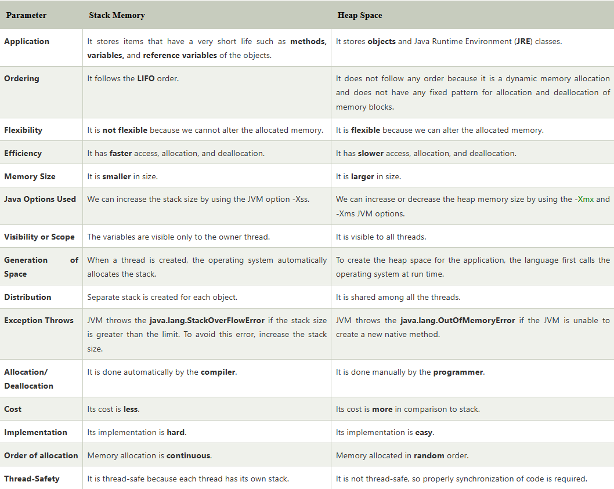

# Stack & Heap in Java (Memory Management)

In Java, memory is divided into two main parts: the stack and the heap.
Java Heap Space is used throughout the application, but Stack is only used for the method — or methods — currently running


## 1. Stack

The stack is a special area of memory that stores **local variables** and **function calls**. When a method is called, a new stack frame is created to store the method's local variables and parameters. When the method returns, the stack frame is destroyed, and the memory is reclaimed.

The stack is a LIFO (Last In, First Out) data structure, meaning that the last item added to the stack is the first one to be removed. This makes it very efficient for function calls and local variable storage.

### Stored on the Stack

1. **Local Variables**: Variables declared inside a method are stored on the stack.
2. **Function Calls**: Each function call creates a new stack frame to store local variables and parameters.
3. **Return Addresses**: The address of the next instruction to be executed after a function call is stored on the stack.
4. **References to Objects**: References to objects are stored on the stack, while the objects themselves are stored on the heap.
5. **Parameters**: Method parameters are stored on the stack.

### Recursion and Stack

Recursion is a programming technique where a function calls itself. Each recursive call creates a new stack frame, which can lead to stack overflow if too many recursive calls are made.

## 2. Heap

The heap is a larger area of memory that stores objects and arrays. When an object is created using the `new` keyword, memory is allocated on the heap to store the object's data. The heap is managed by the Java Virtual Machine (JVM) and has a more complex memory management system than the stack.

The heap is a more flexible data structure than the stack, as it allows objects to be created and destroyed dynamically. However, this flexibility comes at the cost of performance, as heap memory allocation and deallocation are more expensive than stack memory operations.

### Stored on the Heap

1. **Objects**: Objects created using the `new` keyword are stored on the heap.
2. **Arrays**: Arrays are also stored on the heap.
3. **Static Variables**: Static variables are stored on the heap and are shared among all instances of a class.


### String Pool

The string pool is a special area of the heap that stores string literals. When a string literal is created, it is stored in the string pool, and subsequent references to the same string literal will return the same object from the string pool.



For example:

```java
String s1 = "Hello";
String s2 = "Hello";
System.out.println(s1 == s2); // Output: true
```

The `==` operator compares the memory addresses of the two string objects. Since both `s1` and `s2` refer to the same string literal in the string pool, the comparison returns `true`.
However, if you create a string object using the `new` keyword, it will be stored on the heap, and the `==` operator will return `false`.

```java
String s3 = new String("Hello");
String s4 = new String("Hello");
System.out.println(s3 == s4); // Output: false
System.out.println(s3.equals(s4)); // Output: true
```

The `equals()` method compares the contents of the two string objects, so it returns `true` in this case.


### Garbage Collection

The heap is managed by the JVM's garbage collector, which periodically scans the heap for objects that are no longer in use and frees up the memory they occupy. This process is called garbage collection and is essential for preventing memory leaks and ensuring that the heap does not run out of memory.

## Summary

Source: [Stack and Heap in Java](https://www.javatpoint.com/stack-vs-heap-java)



```java
class Person {
    int id;
    String name;

    public Person(int id, String name) {
        this.id = id;
        this.name = name;
    }
}

public class PersonBuilder {
    private static Person buildPerson(int id, String name) {
        return new Person(id, name);
    }

    public static void main(String[] args) {
        int id = 23;
        String name = "John";
        Person person = null;
        person = buildPerson(id, name);
    }
}
```


