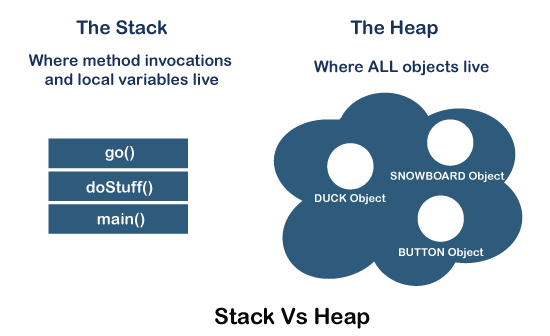
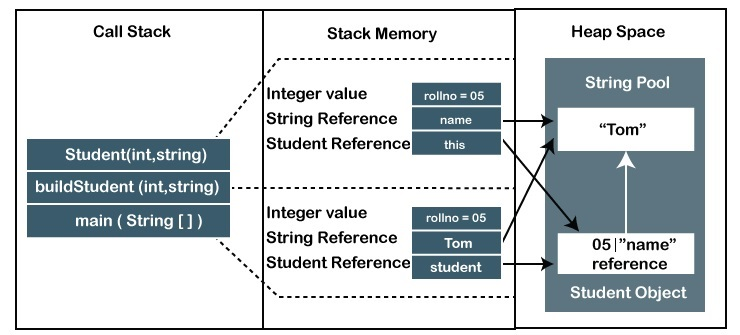

# Stack & Heap in Java (Memory Management)

In Java, memory is divided into two main parts: the stack and the heap. Understanding how these two memory areas work is essential for writing efficient and bug-free Java programs.

## 1. Stack

The stack is a special area of memory that stores local variables and function calls. When a method is called, a new stack frame is created to store the method's local variables and parameters. When the method returns, the stack frame is destroyed, and the memory is reclaimed.

The stack is a LIFO (Last In, First Out) data structure, meaning that the last item added to the stack is the first one to be removed. This makes it very efficient for function calls and local variable storage.

### Recursion and Stack

Recursion is a programming technique where a function calls itself. Each recursive call creates a new stack frame, which can lead to stack overflow if too many recursive calls are made.

## 2. Heap

The heap is a larger area of memory that stores objects and arrays. When an object is created using the `new` keyword, memory is allocated on the heap to store the object's data. The heap is managed by the Java Virtual Machine (JVM) and has a more complex memory management system than the stack.

