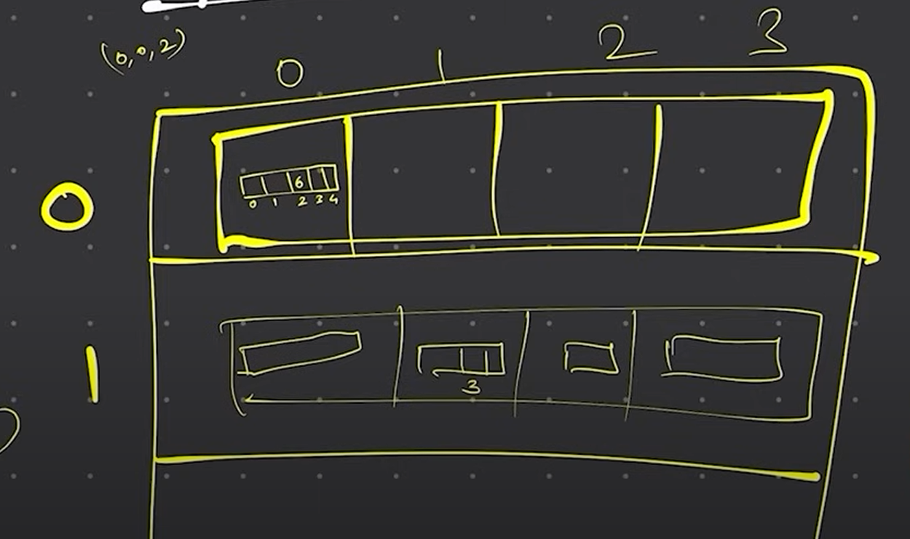

# Arrays in Java

An array is a data structure that stores a fixed-size collection of elements of the same type. In Java, arrays are objects that can be created using the `new` keyword or using array literals.

1. **Homogeneous**: An array can only store elements of the same type.
2. **Fixed Size**: The size of an array is fixed when it is created and cannot be changed.
3. **Zero-based Indexing**: The index of the first element in an array is 0.
4. **Length Property**: The length property of an array returns the number of elements in the array.
5. **Accessing Elements**: Elements in an array can be accessed using their index.
6. **Iterating Over an Array**: You can use a loop to iterate over the elements of an array.

## Creating Arrays

```java
// Creating an array of integers
int[] numbers = new int[5]; // Array of size 5, all elements initialized to 0

// Creating an array of strings
String[] names = {"Alice", "Bob", "Charlie"};

// Accessing elements of an array
System.out.println(numbers[0]); // Output: 0
System.out.println(names[1]); // Output: Bob

// Iterating over an array
for (int i = 0; i < names.length; i++) {
    System.out.println(names[i]);
} // Output: Alice Bob Charlie

```

## Multidimensional Arrays

A multidimensional array is an array of arrays. In Java, you can create arrays with multiple dimensions.


```java
// Creating a 2D array
int[][] matrix = new int[3][3]; // 3x3 matrix

// Initializing a 2D array
int[][] matrix = {{1, 2, 3}, {4, 5, 6}, {7, 8, 9}};

// Accessing elements of a 2D array
System.out.println(matrix[0][0]); // Output: 1
System.out.println(matrix[1][2]); // Output: 6

// Iterating over a 2D array
for (int i = 0; i < matrix.length; i++) {
    for (int j = 0; j < matrix[i].length; j++) {
        System.out.print(matrix[i][j] + " ");
    }
    System.out.println();
} 
```



```java
// Creating a 3D array

int[][][] cube = new int[3][3][3]; // 3x3x3 cube

// Initializing a 3D array

int[][][] cube = {
    {{1, 2, 3}, {4, 5, 6}, {7, 8, 9}},
    {{10, 11, 12}, {13, 14, 15}, {16, 17, 18}},
    {{19, 20, 21}, {22, 23, 24}, {25, 26, 27}}
};

// Accessing elements of a 3D array

System.out.println(cube[0][0][0]); // Output: 1
System.out.println(cube[1][2][1]); // Output: 17

// Iterating over a 3D array

for (int i = 0; i < cube.length; i++) {
    for (int j = 0; j < cube[i].length; j++) {
        for (int k = 0; k < cube[i][j].length; k++) {
            System.out.print(cube[i][j][k] + " ");
        }
        System.out.println();
    }
} 
```

## Arrays Class

The `java.util.Arrays` class provides utility methods for working with arrays in Java. Some common methods include:

```java
int[] numbers = {5, 2, 8, 1, 9};

// Sorting an array
Arrays.sort(numbers); // [1, 2, 5, 8, 9]

// Searching in an array
int index = Arrays.binarySearch(numbers, 5); // 2

// Filling an array
Arrays.fill(numbers, 0); // [0, 0, 0, 0, 0]

// Converting an array to a string
String str = Arrays.toString(numbers); // [0, 0, 0, 0, 0]

// Comparing arrays
int[] numbers2 = {5, 2, 8, 1, 9};
boolean equal = Arrays.equals(numbers, numbers2); // true
```

## Summary
