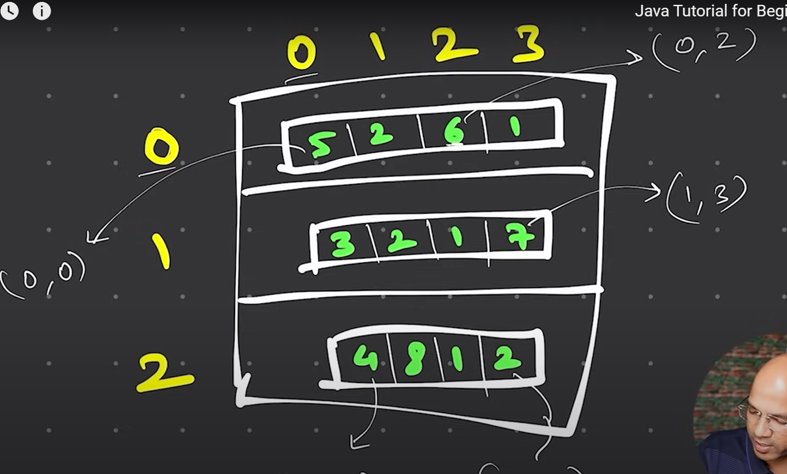

# Arrays in Java

An array is a data structure that stores a fixed-size collection of elements of the same type. In Java, arrays are objects that can be created using the `new` keyword or using array literals.

1. **Homogeneous**: An array can only store elements of the same type.
2. **Fixed Size**: The size of an array is fixed when it is created and cannot be changed.
3. **Zero-based Indexing**: The index of the first element in an array is 0.
4. **Length Property**: The length property of an array returns the number of elements in the array.
5. **Accessing Elements**: Elements in an array can be accessed using their index.
6. **Iterating Over an Array**: You can use a loop to iterate over the elements of an array.

## Creating Arrays

```java
// Creating an array of integers
int[] numbers = new int[5]; // Array of size 5, all elements initialized to 0

// Creating an array of strings
String[] names = {"Alice", "Bob", "Charlie"};

// Accessing elements of an array
System.out.println(numbers[0]); // Output: 0
System.out.println(names[1]); // Output: Bob

// Iterating over an array
for (int i = 0; i < names.length; i++) {
    System.out.println(names[i]);
} // Output: Alice Bob Charlie

```

